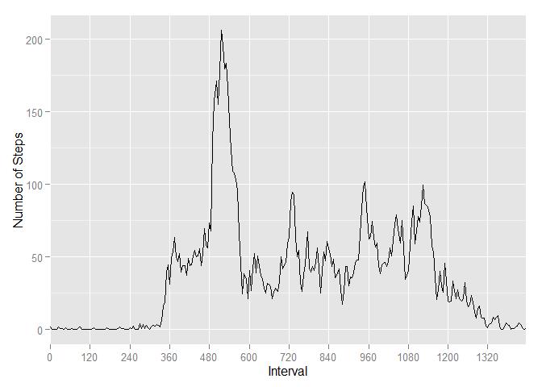

# Reproducible Research: Peer Assessment 1
Author: Van Hai Ho

## Loading and preprocessing the data

1. Load the data from zip file:


```r
activityData <- read.csv(unz("activity.zip", filename = "activity.csv"), 
                 header = TRUE, sep = ",");
```

2. Process/Transform the data for analysis: Convert second column to Date type:

```r
activityData$date <- as.Date(activityData$date, "%Y-%m-%d")
```

## What is mean total number of steps taken per day?

1. Make a histogram of the total number of steps taken each day:


```r
# Total steps taken each day
activityDaily <- aggregate(activityData$steps, 
                           by = list(activityData$date), sum)

# Provide friendly names to the daily activity data frame
names(activityDaily) <- c("Date", "Steps")

# Plot histogram of the total number of steps taken each day
library(ggplot2)
ggplot(activityDaily, aes(x = activityDaily$Steps)) + 
    geom_histogram(binwidth = 1000, colour = "black", fill = "white") +
    xlab("Number of steps daily") +
    ylab("Day count")
```

 

2. Calculate and report the mean and median total number of steps taken per day:

```r
# Mean total number of step taken per day
mean(activityDaily$Steps, na.rm = TRUE)
```

```
## [1] 10766
```

```r
# Median total number of step taken per day
median(activityDaily$Steps, na.rm = TRUE)
```

```
## [1] 10765
```

## What is the average daily activity pattern?

1. Make a time series plot (i.e. type = "l") of the 5-minute interval (x-axis) and the average number of steps taken, averaged across all days (y-axis)


```r
# Function averageDailyActivityPattern calculates the average 
# daily activity pattern
averageDailyActivityPattern <- function(activityData) {
    
    # Ignore missing values
    activityDataNNA <- activityData[!is.na(activityData$steps), ]
    
    # Average number of steps taken throughout the day at 5-minute interval
    dailyActivity <- aggregate(activityDataNNA$steps, 
                                by = list(activityDataNNA$interval), mean)
    names(dailyActivity) <- c("interval", "average5m")
    
    # Update index of 5 minute interval
    dailyActivity <- transform(dailyActivity, 
                               interval5m = seq(from = 0, to = (nrow(dailyActivity) * 5) - 1, by = 5))
    
    # Return dailyActivity
    dailyActivity
}

# Invoke function to calculate average daily activity pattern
dailyActivity <- averageDailyActivityPattern(activityData)

# Plot average daily activity pattern
ggplot(dailyActivity, 
       aes(x = dailyActivity$interval5m, y = dailyActivity$average5m)) +
    geom_line() +
    xlab("Interval") +
    ylab("Number of Steps") +
    scale_x_discrete(breaks=seq(from=0, to=1439, by=120))
```

 

2. Which 5-minute interval, on average across all the days in the dataset, contains the maximum number of steps?


```r
# The 5-minute interval that contains the maximum number of steps on average across all the days in the dataset.
dailyActivity[which.max(dailyActivity$average5m), "interval"]
```

```
## [1] 835
```

## Imputing missing values

1. Calculate and report the total number of missing values in the dataset (i.e. the total number of rows with NAs)

```r
sum(is.na(activityData$steps))
```

```
## [1] 2304
```

2. Devise a strategy for filling in all of the missing values in the dataset. The strategy does not need to be sophisticated. For example, you could use the mean/median for that day, or the mean for that 5-minute interval, etc.

Missing values will be replaced by the average of number of steps taken at that 5-minute interval in a day.

3. Create a new dataset that is equal to the original dataset but with the missing data filled in.


```r
# Function fillMissingValues creates a new data frame that is
# equal to the original dataset but with missing data filled
# in with the average number of steps at that 5 minute interval.
fillMissingValues <- function(activityData, dailyActivityPattern) {
    newData <- data.frame()
    for (i in 1:nrow(activityData)) {
        # add a new row to the new data frame
        newData <- rbind(newData, activityData[i, ])
        
        if (is.na(activityData[i, 1])) {
            # replace this with the average steps for this interval
            naInterval <- activityData[i, 3]
            patternIndex <- match(naInterval, dailyActivityPattern$interval)
            newData[i, 1] <- dailyActivityPattern[patternIndex, "average5m"]
        }
    }
    newData
}

# invoke fillMissingValues function to create a new dataset
newDataSet <- fillMissingValues(activityData, dailyActivity)
```

4. Make a histogram of the total number of steps taken each day and Calculate and report the mean and median total number of steps taken per day. Do these values differ from the estimates from the first part of the assignment? What is the impact of imputing missing data on the estimates of the total daily number of steps?


```r
# Total steps taken each day with new dataset
newActivityDaily <- aggregate(newDataSet$steps, 
                           by = list(newDataSet$date), sum)
# Provide friendly names to the daily activity data frame
names(newActivityDaily) <- c("Date", "Steps")

# Plot histogram of the total number of steps taken each day
library(ggplot2)
ggplot(newActivityDaily, aes(x = newActivityDaily$Steps)) + 
    geom_histogram(binwidth = 1000, colour = "black", fill = "white") +
    xlab("Number of steps daily") +
    ylab("Day count")
```

 

```r
# Calculate and report the mean total number of steps taken
# per day for new data set
mean(newActivityDaily$Steps, na.rm = TRUE)
```

```
## [1] 10766
```

```r
# Median total number of step taken per day for new data set
median(newActivityDaily$Steps, na.rm = TRUE)
```

```
## [1] 10766
```

The values are slightly difference from the estimates from the first part of the assignment. As the missing values are ignored previously, and replaced with the mean steps at an interval in the new data set, the means total number of steps taken per day remain the same, however, the number of elements included in the calculation are different, the medians total number of steps per day are different.

## Are there differences in activity patterns between weekdays and weekends?

1. Create a new factor variable in the dataset with two levels - "weekday" and "weekend" indicating whether a given date is a weekday or weekend day.


```r
createDateFactor <- function(newDataSet) {
    df <- c()
    dates <- newDataSet$date
    for (i in 1:length(dates)) {
        wd <- weekdays(dates[i])
        if (wd %in% c("Saturday", "Sunday")) {
            df <- c(df, "weekend")
        } else {
            df <- c(df, "weekday")
        }
    }
    df
}

# Invoke function to create date factor variable
dateFactor <- factor(createDateFactor(newDataSet))

# Add new factor variable to the new data set
newDataSet <- transform(newDataSet, datefactor = dateFactor)
```


2. Make a panel plot containing a time series plot (i.e. type = "l") of the 5-minute interval (x-axis) and the average number of steps taken, averaged across all weekday days or weekend days (y-axis). The plot should look something like the following, which was creating using simulated data:


```r
# Calcuate the average number of steps taken across all weekday days  or weekend days.
averageActivityWd <- aggregate(newDataSet$steps, 
                               by = list(newDataSet$interval, 
                                         newDataSet$datefactor), mean)

# Give a friendly names
names(averageActivityWd) <- c("interval", "datefactor", "steps")

## Plot with 2 panels
library(lattice)
xyplot(averageActivityWd$steps ~ averageActivityWd$interval | averageActivityWd$datefactor, 
       type = "l",
       xlab = "Interval",
       ylab = "Number of steps",
       layout = c(1, 2))
```

 


